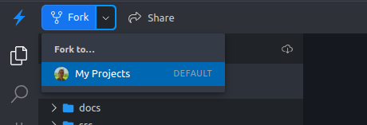

# Sistema de Entregas - Aplicando Mocks de API

Esta é uma calculadora simplificada de fretes. Ela recebe o nomes de uma cidade
de origem e outra de destino, o peso e o volume do item e retorna o custo do
frete de entrega. A aplicação consulta uma **API de localização** para obter a
distância em linha reta entre as cidades e utiliza esse resultado no cálculo do
frente.

## 1. Acesso

### 1.1. Abrindo o projeto no Stackblitz

Primeiramente, abra este projeto usando o link a seguir:

[](https://stackblitz.com/github/diego-aquino/api-mocking-app-delivery?startScript=dev&file=README.md)

Esse link abrirá o editor do Stackblitz no seu navegador, semelhante ao
[VS Code](https://code.visualstudio.com), instalará as dependências e iniciará o
servidor.

No lado esquerdo, estará a estrutura de pastas do projeto, seguida de um editor
e terminal no centro e um mini-navegador no lado direito.


No canto superior esquerdo, clique em "Fork" para salvar o projeto no seu perfil
do Stackblitz. Será necessário fazer login.



## 2. Projeto

Este é um projeto backend que utiliza [Node.js](https://nodejs.org) com
[TypeScript](https://www.typescriptlang.org), [Fastify](https://fastify.dev),
[Axios](https://axios-http.com) e [Vitest](https://vitest.dev).

Arquivos importantes:

- [`src/server/app.ts`](./src/server/app.ts): arquivo principal da aplicação,
  onde o servidor está implementado.
- [`src/clients/LocationClient.ts`](./src/clients/LocationClient.ts): classe que
  faz as chamadas HTTP para a API de localização.
- [`src/utils/shipping.ts`](./src/utils/shipping.ts): implementação da lógica de
  cálculo do frete.
- [`tests/shipping.test.ts`](./tests/shipping.test.ts): arquivo para os testes
  do cálculo do frete.

Comandos úteis:

- `npm install`: instala as **dependências** do projeto (executado
  automaticamente ao abrir o projeto no Stackblitz).
- `npm run dev`: inicia o **servidor** em modo de desenvolvimento.
- `npm run test`: executa os **testes** da aplicação em modo watch.
- `npm run types:check`: verifica se há **erros de tipo** no código.

A URL da API de localização está declarada no arquivo
[`.env.development`](./.env.development). Ela está disponível em duas versões:

| Versão | URL                                    |
| ------ | -------------------------------------- |
| v1     | https://v1-location-d8b1dd3.vercel.app |
| v2     | https://v2-location-d8b1dd3.vercel.app |

> [!TIP]
>
> Acesse os links acima para ver a documentação de cada versão da API.

## 3. Atividade

### Parte 1: Criação de testes

Nesta primeira parte, vamos implementar uma suite de testes para esta aplicação.
Você deve utilizar **uma** das duas ferramentas de mocks de API planejadas,
[MSW](https://github.com/mswjs/msw) ou
[Zimic](https://github.com/zimicjs/zimic), de acordo com a alocação da sua dupla
no Sistema de Entregas
[nesta planilha](https://docs.google.com/spreadsheets/d/1fOp-6efUEp4KZx8UI9w0EuewHeWP1kIhWzWfViSihW0/edit?usp=sharing).

Você deverá implementar **quatro** casos de teste no arquivo
[`tests/shipping.test.ts`](./tests/shipping.test.ts). A escolha de quais
aspectos da aplicação testar é livre, considerando as diretrizes a seguir:

1. Todos os testes devem realizar pelo menos uma requisição à aplicação.
2. Todos os testes devem exercitar comportamentos que fazem uso de chamadas à
   API de localização. Porém, a API não deve ser acessada diretamente nos seus
   testes, ou seja, todas as respostas devem ser simuladas pelos mocks.
3. Pelo menos um caso de teste deve verificar uma resposta de sucesso da
   aplicação (códigos de status
   [2XX](https://developer.mozilla.org/en-US/docs/Web/HTTP/Status#successful_responses)).
4. Pelo menos um caso de teste deve verificar uma resposta de erro da aplicação
   (códigos de status
   [4XX](https://developer.mozilla.org/en-US/docs/Web/HTTP/Status#client_error_responses)
   ou
   [5XX](https://developer.mozilla.org/en-US/docs/Web/HTTP/Status#server_error_responses)).

Para executar os testes, utilize o comando `npm run test`. Com esse comando
rodando, a suite será reexecutada automaticamente ao editar a aplicação ou os
testes.


Após implementar os casos descritos acima, salve o link de compartilhamento do
projeto. Você deverá enviá-lo no formulário de entrega.


### Parte 2: Migração para a versão 2 da API

Nesta segunda parte, vamos migrar o projeto para utilizar a versão 2 da API de
localização, que possui certas mudanças em relação à versão 1.

Antes de iniciar, crie uma cópia do projeto que você utilizou na parte 1. Para
isso, clique no botão "Fork" no canto superior. O objetivo é manter o projeto da
parte 1 inalterado e utilizar uma cópia dele para migrar para a versão 2 da API.


Na cópia criada, você deve alterar o arquivo
[`.env.development`](./.env.development) para utilizar a URL da versão 2 da API,
atualizando o valor da variável `LOCATION_API_URL` para o endereço abaixo.

`.env.development`:

```bash
LOCATION_API_URL=https://v2-location-d8b1dd3.vercel.app
```

Se o servidor ou o comando de testes estiverem rodando, você deve reiniciá-los
para que a nova URL seja lida.

Entre as versões 1 e 2 da API, as seguintes modificações ocorreram:

- A rota `/cities/distances`, em que os identificadores das cidades origem e
  destino eram definidas por meio de parâmetros de query, foi modificada para
  `/cities/:originCityId}/distances/cities/:destinationCityId`, movendo os
  identificadores para parâmetros de rota;
- No retorno das cidades, os seguintes campos foram modificados:
  - `stateName` e `stateCode` agora fazem parte de um objeto `state`, nas
    propriedades `state.name` e `state.code`, respectivamente.
  - `countryName` e `countryCode` agora fazem parte de um objeto `country`, nas
    propriedades `country.name` e `country.code`, respectivamente.

Agora, você deve adaptar os testes e os mocks de API para lidar com essas
mudanças. Para executar a suite, naturalmente é necessário também alterar a
aplicação e integrá-la à nova versão da API. Nesta atividade, o refatoramento da
aplicação não é obrigatório, embora seja recomendado para verificar se os testes
estão funcionando corretamente.

Após realizar as adaptações, salve o link de compartilhamento do projeto usado
nesta parte 2. Você também deverá enviá-lo no formulário de entrega, juntamente
com o link da parte 1.

## 4. Entrega

Após finalizar as implementações nesta aplicação e no
[Sistema de Compartilhamento](https://github.com/diego-aquino/api-mocking-app-sharing),
preencha o formulário de entrega com os links das partes 1 e 2. Confirme que
todos os links estão com visibilidade pública.

https://forms.gle/FP8gzzaBniawu6EV8
